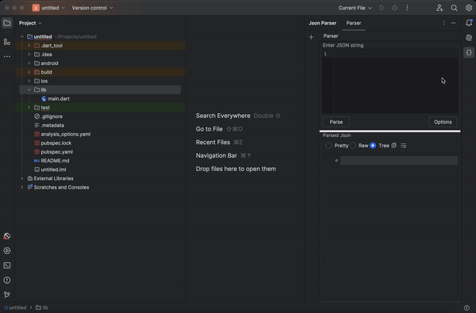
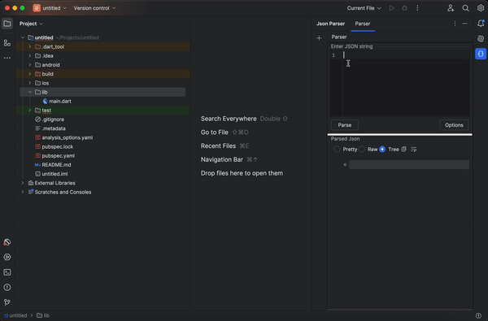
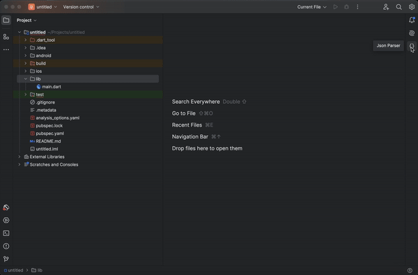
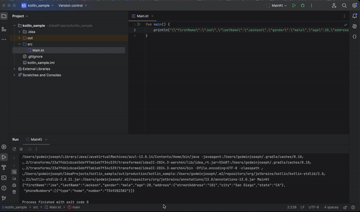
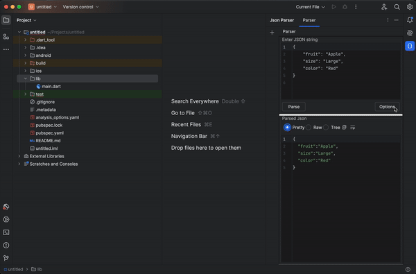
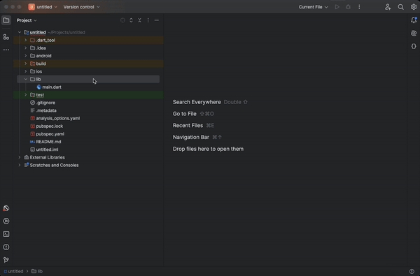
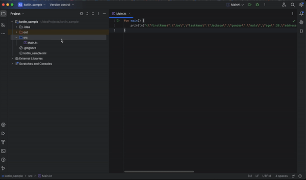
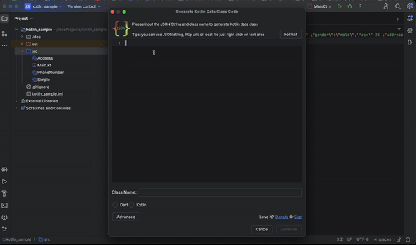
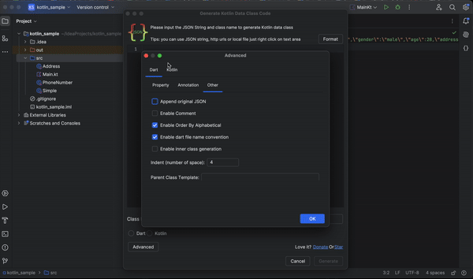

# Json Parser

[//]: # (![Build]&#40;https://github.com/godwinjk/Json_Parser/workflows/Build/badge.svg&#41;)

# JSON PARSER

<!-- Plugin description -->
Simple JSON Parser is an IntelliJ IDE plugin for validation and formatting JSON string 
<!-- Plugin description end -->

## Features

- [x] Dart code generation
- [x] Kotlin code generation
- [x] Retrieve Json from web
- [x] Load Json from local
- [x] Pretty print Json
- [x] Validate Json
- [x] Single click formatting from logcat or console window
- [x] Tree model view, so user can easily hide or expand particular object

## Installation

- Using IDE built-in plugin system:
  <kbd>Settings/Preferences</kbd> > <kbd>Plugins</kbd> > <kbd>Marketplace</kbd> > <kbd>Search for "Json Parser"</kbd> >
  <kbd>Install Plugin</kbd>

- Manually:
  Download the [latest release](https://github.com/godwinjk/Json_Parser/releases/latest) and install it manually using
  <kbd>Settings/Preferences</kbd> > <kbd>Plugins</kbd> > <kbd>⚙️</kbd> > <kbd>Install plugin from disk...</kbd>

## Functions example

## Support My Work

If you’ve found this project helpful or valuable, consider supporting its development!
Your contributions help me dedicate more time to improving the project, adding features, and maintaining it for the
community.
Every donation, no matter the size, makes a difference and is deeply appreciated. ❤️

## Changelog

### Version 1.8.0 🎉

You wll love this.

Json parser now support code generation. Yes you heard it right. Json Parser now support
code generation from Kotlin and Dart.

### Version 1.7.4

Added a bunch of features to JSON parser. Now you can retrieve JSON from web and also you can load from your local
system.

1. Retrieve from Web. You can add header too in the next line separated with colon symbol. Each header key value pair
   should be in the next line.
2. Load from your local system

### Version 1.7.3

1. Compatibility issue resolved

### Version 1.7.2

1. Unquoted fields and single quoted fields now supported
2. YAML comments and normal comments will not throw error anymore
3. Deprecation fixes
4. Runtime error fixed

### Version 1.7.1

1. Tree view bug fixes

### Version 1.7

1. Significant Change in tree view.
2. Major bug fixes

### Version 1.6.1

1. Updated for new latest version support

### Version 1.5

1. Now you can directly open JsonParser window from logcat or console window. No need to copy and paste from multiple
   window.
2. Tree structure updated with child number and object number for arrays.
3. Copy to clipboard added.

### Version 1.4

1. Multiple tabs added
2. Rate/ donate tab issue fixed
3. Menu item added under Edit menu (ctrl shift alt J)

### Version 1.3

1. Bug fixes

### Version 1.2

Added 3 options

- Pretty print
- Raw
- Tree

### Version 1.2.1

1. Error message if not a valid json
2. Bug fixes

### Version 1.1

Support for all platforms.

### Version 1.0

Parse VALID JSON string only.

