# Advanced JSON Studio

  OR

📖 **[Frequently Asked Questions →](FAQ.md)**

# Advanced JSON Studio v2026.1.4

The Intelligent JSON Workspace for IntelliJ

**JSON Parser** has evolved. We are proud to introduce **Advanced JSON Studio**—a complete engineering environment
designed to handle everything from massive API responses to broken configuration files. It’s the last JSON tool you’ll
ever need.

<kbd>Auto-Parse</kbd> <kbd>Pretty-Print</kbd> <kbd>Validator</kbd> <kbd>Local-Load</kbd> <kbd>Web-Fetch</kbd> <kbd>
Persistence</kbd> <kbd>Tabs</kbd> <kbd>Rename-Tabs</kbd> <kbd>Open-In-Editor</kbd> <kbd>Tree-View</kbd> <kbd>
Graph-View</kbd> <kbd>JSONPath</kbd> <kbd>
JMESPath</kbd> <kbd>Autocomplete</kbd>
<kbd>JWT-Decode</kbd> <kbd>JWT-Verify</kbd> <kbd>YAML</kbd> <kbd>XML</kbd> <kbd>TOML</kbd> <kbd>Properties</kbd> <kbd>
CBOR</kbd> <kbd>BSON</kbd> <kbd>Export</kbd>
<kbd>Schema-Inference</kbd> <kbd>Minifier</kbd> <kbd>Sorting</kbd> <kbd>Stats-Bar</kbd> <kbd>Diff-Checker</kbd> <kbd>
Mock-Data</kbd> <kbd>AI-Repair</kbd> <kbd>Dart</kbd> <kbd>Kotlin</kbd> <kbd>Cloud-CodeGen</kbd> <kbd>
Tip-of-the-Day</kbd> <kbd>Schema-Validator</kbd> <kbd>CSV-Table</kbd> <kbd>Flatten</kbd> <kbd>Unflatten</kbd> <kbd>Base64-Decode</kbd> <kbd>Rich-Pretty-Print</kbd>

> ## Important Update: Advanced JSON Studio is moving to a Freemium Model
>
> Advanced JSON Studio is evolving. To ensure this tool remains a high-quality, professional-grade asset for the
> ecosystem, I am transitioning the plugin to a freemium model.
>
> For the past several years, I have been the sole developer building and maintaining this project as a gift to the
> community. However, for the plugin to reach a truly sustainable state—one that guarantees rapid bug fixes, long-term
> support, and continuous innovation—it requires a model that supports the development efforts. This shift is a
> necessary
> step to transform a passion project into a stable, professional ecosystem that you can rely on for your daily
> workflow.
>
> #### What stays Free?
> The core features you’ve always relied on remain accessible at no cost. I believe in keeping the essentials available
> to everyone:
>
> 1. Core JSON Parsing: Fast, reliable tree views and data exploration.
> 2. Basic Search & Filter: Essential tools to find what you need in large files.
>
> #### The Premium Hood
> To support the project's growth, advanced and newly added features will now require a subscription. These include:
>
> 1. Advanced Export Options: Enhanced XML and custom format conversions.
> 2. High-Performance Layouts: New, complex graph algorithms for massive datasets.
>
> #### A Generous Daily Allowance
> I want to ensure that students and casual users are never fully blocked. I have implemented a generous daily free
> usage limit for premium features. This means you can still access advanced tools every day; your access is simply
> restricted once the daily threshold is met, rather than being locked away behind a hard wall.
>
> Thank you for being part of this journey. Your support directly allows me to dedicate the time needed to keep this
> plugin bug-free, modern, and powerful. Together, we are building a more sustainable future for the developer
> community.
>
> _— Godwin_

## 🚀 What's New in v2026.1.4

## 🔍 JSON Schema Validator

- New **Schema Validator** tab with a full schema authoring and validation workflow
- **List mode** — errors displayed as a clean, scrollable result list with line references
- **Annotated mode** — validation errors highlighted inline directly in the Pretty tab output
- **Save, edit, and delete** named schemas — persistent across sessions, instantly switchable via dropdown
- **Add new schema** from scratch or paste any existing JSON Schema
- Schema editor panel is collapsible to give more space to results

## 📊 CSV Table View

- New **CSV tab** converts JSON arrays into a sortable, scrollable **JTable** — no more raw text
- Intelligently handles all JSON shapes: arrays of objects, primitive arrays, arrays of arrays, and mixed types
- Nested objects and arrays inside cells are shown as compact JSON strings
- **Download button** saves the current view as a properly escaped `.csv` file (RFC-4180 compliant)
- Row and column count shown in the footer

## 🔠 Base64 Auto-Detection

- Paste any **Base64-encoded JSON** string into the input editor — the parser detects and decodes it automatically
- No separate tab or button needed; decoded JSON flows through the full pipeline like any other input
- Detected format label shows **"Detected Base64"** to confirm the decoding step
- **Base64 Encode tab** encodes the current JSON to a Base64 string for copying or sharing

## 📐 Flatten / Unflatten

- **Flatten tab** — converts nested JSON into flat dot-notation key–value pairs (e.g. `user.address.city`)
- **Unflatten tab** — rebuilds a nested JSON object from flat dot-notation keys
- Both tabs support arrays using index notation (e.g. `items.0.name`)

## 🎨 Rich Pretty Print

- The **Pretty tab** now renders live visual decorations directly in the editor gutter and inline:
- **Color swatches** — hex (`#ff6b35`), `rgb()`, and `hsl()` values show a live color square in the gutter
- **Image thumbnails** — image URLs and `data:image/` URIs show a 16px thumbnail; click it to open a full preview popup
- **Link icons** — HTTP(S) URLs get a globe icon in the gutter
- **Calendar icons** — ISO date-only strings (e.g. `"2024-01-15"`) get a calendar gutter icon
- **Clock icons** — ISO datetimes and Unix timestamps on time-related keys get a clock gutter icon
- **UUID badges** — UUID values get a `#` gutter badge
- **Inlay hints** — Unix timestamps and ISO datetimes show a human-readable date hint; large numbers, file sizes, durations, and byte counts get formatted inline hints
- All decorations are individually toggleable in **Parser Settings → Rich Editor Decorations**

---

## 🔒 Privacy Mode

- Toggle the **Privacy Mode** shield icon next to the detected format label to block all cloud calls for the session
- A green animated border strokes clockwise around the parser as visual confirmation
- **AI repair** and **cloud code generation** are blocked; local heuristic repair still runs fully offline
- State is session-only — never saved to disk, always off on restart

## 🌐 HTTP Client Upgrades

- **PUT** and **PATCH** methods now supported with request body
- New **cURL tab** — paste a curl command and execute it safely without any shell involvement

## 🗂️ Tab Improvements

- **Close button (✕)** on every tab with hover highlight; last tab is protected from closing
- Tab rename now enforces 2–30 character limit with inline validation

---

## 🚀 What's New in Previous Versions

Stop wrestling with malformed data. Elevate your development workflow with these powerful new capabilities:

## 🧠 Intelligent Parsing & Repair

* **Live Auto-parse**: Results update instantly as you type—no "Process" button required.
* **AI-Powered Repair**: Automatically fix malformed JSON using built-in heuristics or AI strategies (can be disabled in
  settings If you need privacy).
* **Multi-Format Support**: Seamlessly handle JSON5, JSON, YAML, XML, and TOML in a single unified interface.

## 🔄 Instant Conversions

* Transform your data structures with one click:
* **To Code**: Generate 12 different languages with precision.
* **To Config:** Export to YAML, XML, TOML, or .properties.
* **To Binary**: Convert to CBOR or BSON instantly.
* **Schema Inference**: Automatically generate a JSON Schema from any structure.

## 🛠️ Professional Engineering Tools

* **JSONPath & JMESPath**: Query your data with live autocomplete support.
* **Structural Diff**: Compare two JSON documents side-by-side with smart highlighting.
* **Data Generation**: Create realistic dummy JSON for testing (customize structure, depth, and size).
* **Web Retrieval**: Fetch JSON from URLs with support for custom headers.
* **Local File Access**: Effortless loading via the new dedicated sidebar.

## 🎨 Productivity Features

* **Session Management**: Work across multiple isolated tabs; sessions are restored automatically on restart.
* **Advanced Formatting**: Custom indentation (1–8 spaces), alphabetical sorting, and one-click Minify/Uglify.
* **Visual Navigation**: Explore complex objects using the intuitive Tree View and Graph View.
* **Live Statistics**: Real-time tracking of key count, nesting depth, object/array counts, and file size.

----
Thank you for upgrading to **Advanced JSON Studio**. If you find this tool helpful, please consider leaving a review on
the JetBrains Marketplace!

## Features

<!-- Plugin description -->
**Advanced JSON Studio: The Intelligent JSON Workspace**

Stop wrestling with malformed data. Elevate your development workflow with the most powerful JSON toolkit for the
IntelliJ Platform.
**Advanced JSON Studio** isn’t just a formatter—it’s a complete engineering environment designed to handle everything
from massive API responses to broken configuration files. It’s the last JSON tool you’ll ever need.

1. **Auto-parse** as you type — results update instantly without pressing a button.
2. Support converting JSON5, JSON, YAML, XML, TOML, Properties, JWT, CBOR and BSON in a single unified interface.
3. Present JSON in a clean, readable format with automated pretty printing.
4. Validate JSON for accuracy and integrity with ease.
5. **Load local JSON** files effortlessly with a dedicated sidebar button.
6. **Retrieve JSON from web** sources quickly — supports custom headers and POST body too.
7. Work across **multiple tabs** — each session is isolated, close and rename tabs individually.
8. Navigate JSON structures effortlessly using an intuitive **Tree View** with live search.
9. Visualize complex JSON structures as interactive **graphs**. Expand the view to explore large datasets with ease.
10. Query JSON using **JSONPath** and **JMESPath** expressions with live autocomplete.
11. Convert **JSON to YAML** instantly.
12. Convert **JSON to XML** instantly.
13. Convert **JSON to TOML** instantly — arrays of objects use correct `[[table]]` syntax.
14. Convert **JSON to .properties** instantly.
15. Convert **JSON to CBOR** instantly.
16. Convert **JSON to BSON** instantly.
17. Infer a **JSON Schema** from your JSON structure automatically.
18. **Decode and verify JWT tokens** — supports HMAC (HS256/384/512), RSA and ECDSA signatures.
19. **Minify/Uglify JSON** to a single line with one click.
20. **Custom indentation** size (1–8 spaces) and alphabetical key sorting.
21. View **live statistics** — key count, depth, object/array counts, and file size.
22. **Compare two JSON documents** side-by-side with structural diff highlighting.
23. **Generate realistic dummy JSON** for testing — choose structure, depth, and size.
24. **Repair malformed JSON** automatically using built-in and AI-powered strategies (can be disabled in settings).
25. **Generate code from JSON** powered by the acclaimed **Quicktype** engine — supports 12 languages: TypeScript,
    JavaScript, TypeScript + Zod, Python, Java, Kotlin, Swift, Go, C#, Rust, Ruby, and Dart. Output is written directly
    into your project directory.
26. **Open parser as a full editor tab** — pop the tool window into the main editor area for more screen space.
27. **Tip of the day** — discover features with in-app tips; dismiss, navigate or disable anytime.
28. Your JSON input is automatically **saved locally** and restored on restart — no cloud sync, fully private.
29. **Localization** — the entire UI is available in 13 languages: Japanese, Korean, Chinese (Simplified), German,
    French, Spanish, Italian, Portuguese (Brazilian), Russian, Polish, Dutch, Turkish, and Czech. Follows your IDE
    locale automatically.
30. **JSON Schema Validator** — validate your JSON against any JSON Schema; save, edit and delete named schemas; view
    errors in a list or as live annotations in the Pretty tab.
31. **CSV Table View** — convert any JSON array to a sortable table; download as `.csv` with one click.
32. **Base64 auto-detection** — paste a Base64-encoded JSON string and it is decoded and parsed automatically; a
    **Base64 Encode** tab encodes the current JSON to a Base64 string.
33. **Flatten / Unflatten** — expand nested JSON into dot-notation flat pairs, or rebuild nested structure from flat keys.
34. **Rich Pretty Print** — live gutter decorations (color swatches, image thumbnails, clock/calendar/link/UUID icons)
    and inline inlay hints (timestamps, sizes, durations, large numbers) in the Pretty tab. All individually toggleable.

<!-- Plugin description end -->

## Features

- [x] Auto-parse on input change
- [x] Pretty print JSON
- [x] Validate JSON
- [x] Load JSON from local (dedicated sidebar button)
- [x] Retrieve JSON from web — GET/POST with custom headers
- [x] JSON data persistence (saved locally, restored on restart)
- [x] **Local Mode** — session-scoped privacy toggle; blocks AI repair and cloud code generation; animated green border indicator
- [x] Multiple tabs with per-tab close button (last tab protected)
- [x] Rename tabs by double-clicking (2–30 character validation)
- [x] Open parser as a full editor tab (pop-out from tool window)
- [x] Tree model view with live search and JSONPath copy
- [x] Graph View with expandable dialog
- [x] JSONPath & JMESPath query with autocomplete suggestions
- [x] JWT decode — header, payload, signature verification (HMAC / RSA / ECDSA)
- [x] Convert to YAML
- [x] Convert to XML
- [x] Convert to TOML (arrays of objects use correct `[[table]]` syntax)
- [x] Convert to Properties
- [x] Convert to CBOR
- [x] Convert to BSON
- [x] Download / save converted files locally
- [x] Infer JSON Schema
- [x] Minify JSON
- [x] Custom indentation size and key sorting
- [x] Live statistics bar (keys, depth, objects, arrays, nulls, size)
- [x] Side-by-side JSON diff checker
- [x] Generate dummy/fake JSON data
- [x] AI-powered JSON repair
- [x] Cloud-based code generation powered by **Quicktype** — TypeScript, JavaScript, TypeScript + Zod, Python, Java, Kotlin, Swift, Go, C#, Rust, Ruby, Dart (blocked in Local Mode)
- [x] HTTP Client with GET, POST, PUT, PATCH, DELETE — plus a cURL tab (safe, shell-free curl parsing)
- [x] Tip of the day — in-app feature discovery bubble
- [x] Open JSON string from editor via intention action
- [x] Inline JSON hints in source files
- [x] Localization — UI available in 13 languages (Japanese, Korean, Chinese, German, French, Spanish, Italian,
  Portuguese BR, Russian, Polish, Dutch, Turkish, Czech)
- [x] **JSON Schema Validator** — validate against saved schemas; List and Annotated result modes; save/edit/delete schemas
- [x] **CSV Table View** — JSON arrays rendered as a sortable JTable; download as .csv
- [x] **Base64 auto-detection** — paste Base64 JSON and it decodes automatically; Base64 Encode tab for the reverse
- [x] **Flatten / Unflatten** — dot-notation flat pairs ↔ nested JSON
- [x] **Rich Pretty Print** — gutter color swatches, image thumbnails, clock/calendar/UUID icons; inlay hints for timestamps, sizes, durations and large numbers

## Installation

- Using IDE built-in plugin system:
  <kbd>Settings/Preferences</kbd> > <kbd>Plugins</kbd> > <kbd>Marketplace</kbd> > <kbd>Search for "Advance Json
  Studio"</kbd> >
  <kbd>Install Plugin</kbd>

- Manually:
  Download the [latest release](https://github.com/godwinjk/Json_Parser/releases/latest) and install it manually using
  <kbd>Settings/Preferences</kbd> > <kbd>Plugins</kbd> > <kbd>⚙️</kbd> > <kbd>Install plugin from disk...</kbd>

❤️❤️❤️❤️❤️

## Functions example

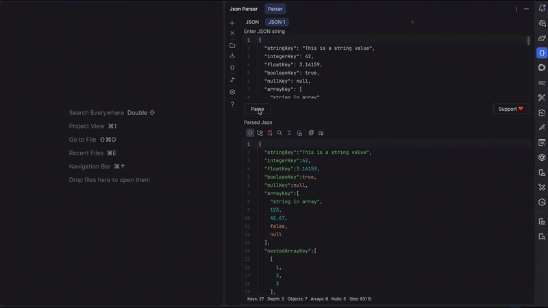
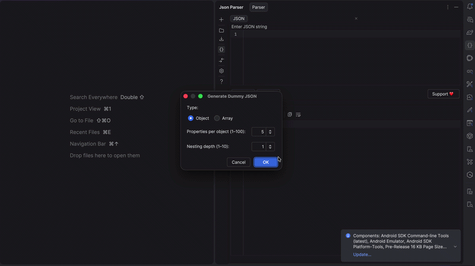
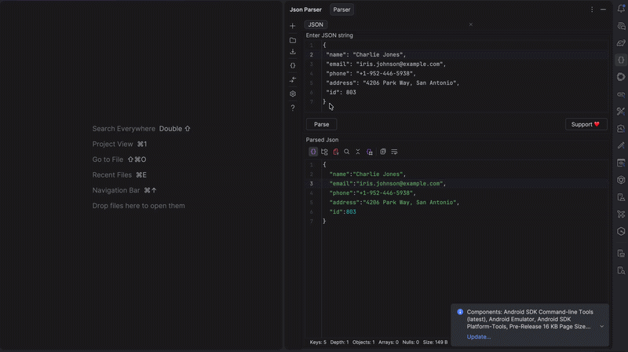
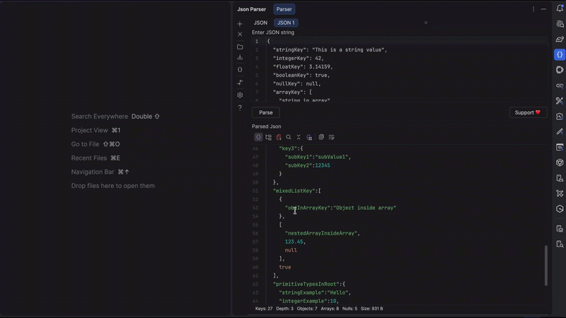
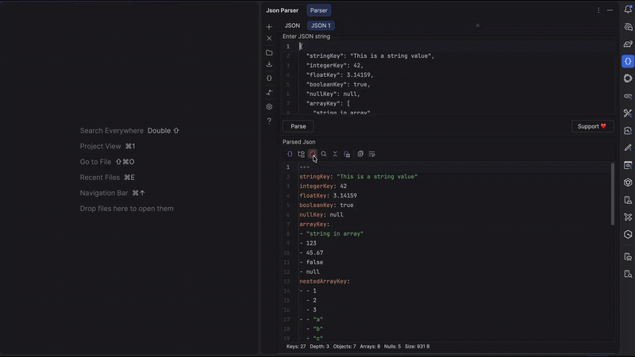
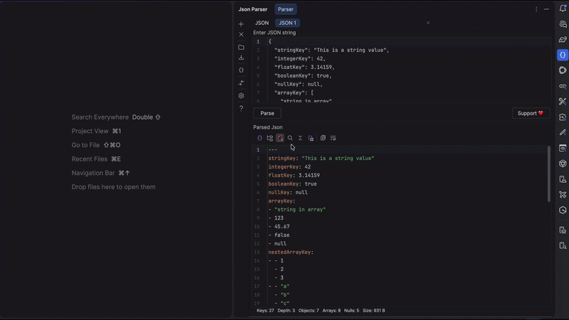
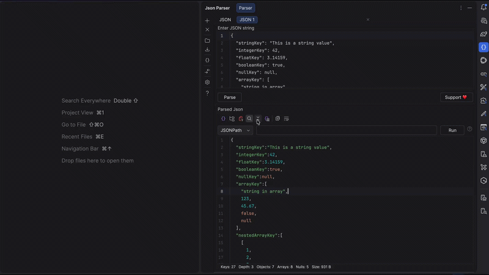
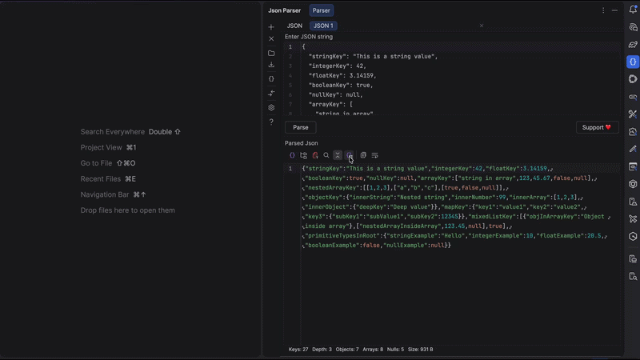
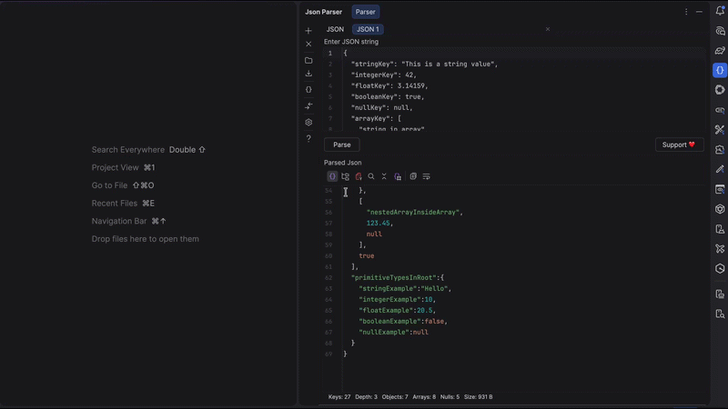
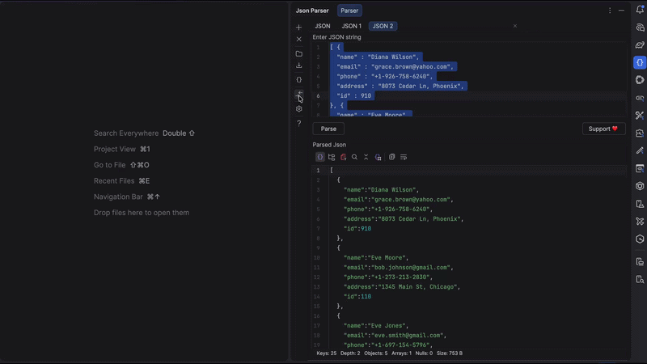
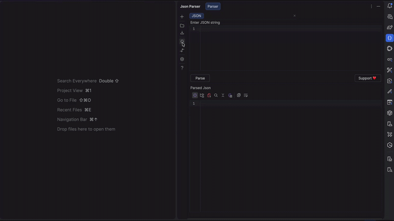
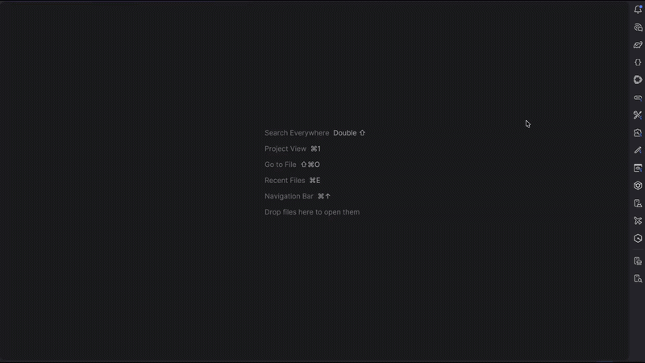
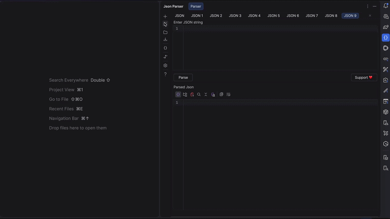
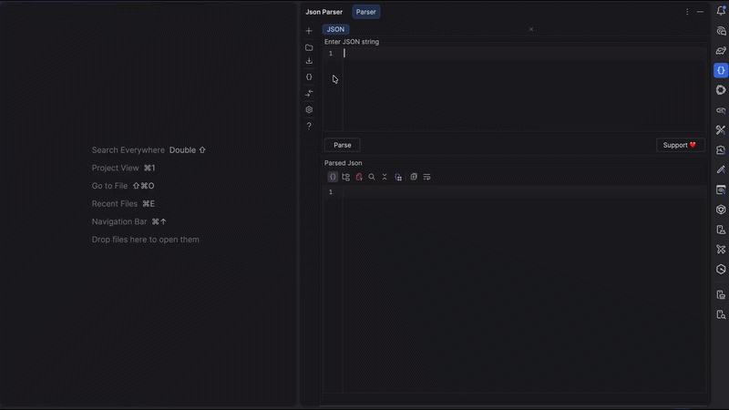
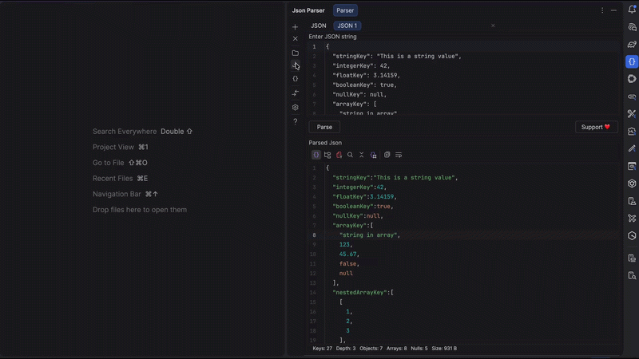
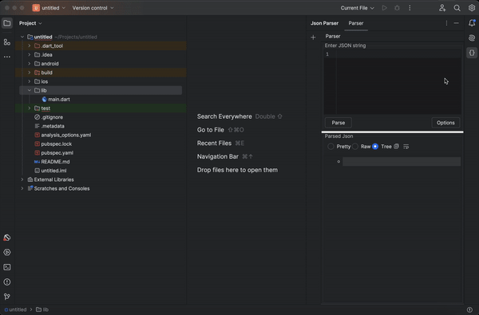
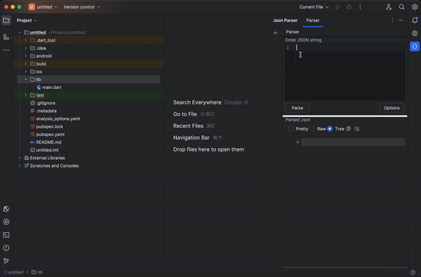
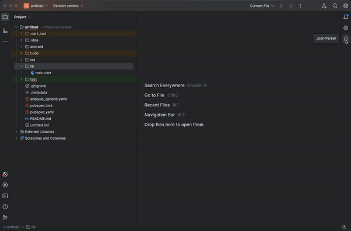
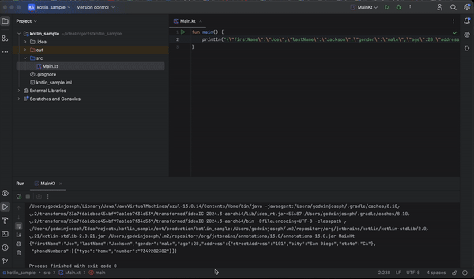
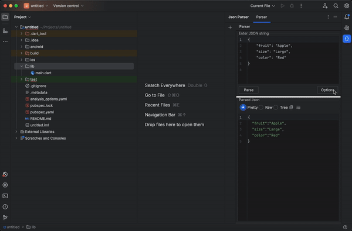
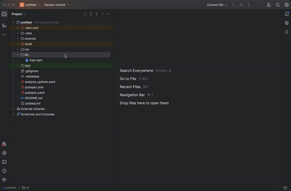
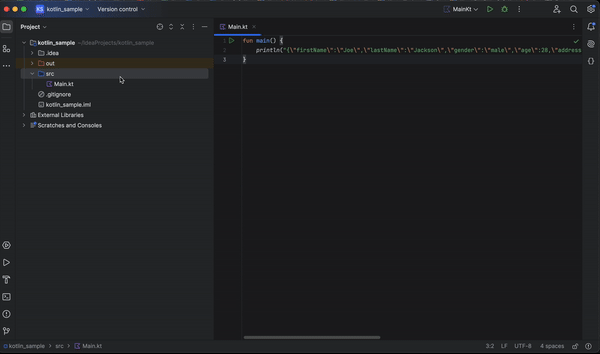
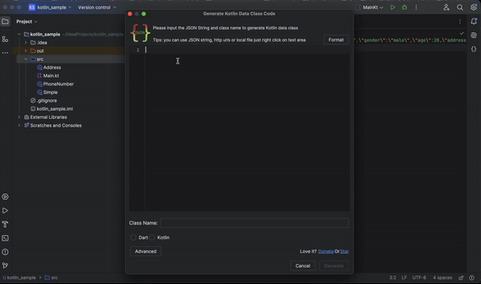
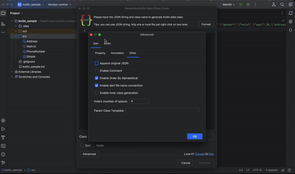

## Support My Work

If you've found this project helpful or valuable, consider supporting its development!
Your contributions help me dedicate more time to improving the project, adding features, and maintaining it for the
community.
Every donation, no matter the size, makes a difference and is deeply appreciated. ❤️

## Changelog

### Version 2026.1.4

**JSON Schema Validator**

- New Schema Validator tab with a full schema authoring and validation workflow
- **List mode** — errors displayed as a scrollable list with JSON path and line references
- **Annotated mode** — validation errors highlighted inline in the Pretty tab using gutter markers and inlay annotations
- Save, edit, rename and delete named schemas — schemas are persisted across sessions and instantly switchable via dropdown
- Schema editor panel is collapsible; **Validate** button triggers on-demand validation

**CSV Table View**

- New CSV tab converts JSON arrays into a sortable, scrollable JTable — alternating row colours for readability
- Handles all JSON shapes: arrays of objects, primitive arrays, arrays of arrays, and mixed-type arrays
- Nested objects and arrays inside cells render as compact JSON strings
- **Download** button saves the current view as a properly escaped `.csv` file (RFC-4180 compliant)
- Row and column count shown in the footer

**Base64 Auto-Detection**

- Pasting a Base64-encoded JSON string into the input editor is now automatically detected and decoded — no extra step required
- Decoded JSON flows through the full parse pipeline; format label shows **"Detected Base64"**
- **Base64 Encode** tab encodes the current JSON to a Base64 string for copying or sharing

**Flatten / Unflatten**

- **Flatten tab** — converts nested JSON into flat dot-notation key–value pairs (e.g. `user.address.city`)
- **Unflatten tab** — rebuilds a nested object from flat dot-notation keys; arrays use index notation (e.g. `items.0.name`)

**Rich Pretty Print**

- The Pretty tab now shows live visual decorations in the gutter and inline:
  - **Color swatches** for hex, `rgb()`, and `hsl()` values
  - **Image thumbnails** for image URLs and `data:image/` URIs; click to open a full-size preview popup
  - **Globe icons** for HTTP(S) URLs
  - **Calendar icons** for ISO date-only strings; **Clock icons** for ISO datetimes and Unix timestamps
  - **UUID `#` badges** for UUID values
  - **Inlay hints** — human-readable dates for timestamps, formatted hints for large numbers, file sizes, and durations
- All decoration types are individually toggleable in **Parser Settings → Rich Editor Decorations** (Pro feature)

**New Tips (21–30)**

- Added 10 new tips covering Base64 decoding, Flatten/Unflatten, CSV table, Schema Validator, and Rich Pretty Print decorations

### Version 2026.1.3

**Local Mode**

- Added a **Local Mode** toggle (shield icon) in the parser toolbar, placed next to the detected format label
- When enabled, a green animated border draws clockwise around the entire parser widget to give clear visual feedback
- Local Mode blocks AI-powered JSON repair from sending data to the cloud — local heuristic repair still works fully offline
- Local Mode blocks cloud-based code generation — a clear warning is shown when the feature is attempted
- State is session-only and never persisted to disk — Local Mode is always off on restart
- Localized: all Local Mode UI strings are part of the plugin's localization system (13 languages)

**HTTP Client**

- Added **PUT** and **PATCH** methods with request body support
- Added a **cURL** tab — paste any curl command and execute it safely without touching a shell (no command injection risk)
- cURL parser supports: `-X`, `-H`, `-d`/`--data-raw`/`--data-binary`, `-u` (Basic Auth), line continuation (`\`), single/double quote handling

**Tab Improvements**

- Added a **close button (✕)** on each tab — hover shows highlighted icon, click closes the tab
- The last tab is now protected and cannot be closed
- Tab rename dialog now validates input: names must be 2–30 characters; OK button stays disabled until the requirement is met

**Localization — 13 Languages**

- The entire plugin UI is now available in 13 languages in addition to English: Japanese, Korean, Chinese (Simplified),
  German, French, Spanish, Italian, Portuguese (Brazilian), Russian, Polish, Dutch, Turkish, and Czech
- The language follows your IDE locale automatically — no configuration required

**Open in Editor**

- Pop the parser out of the tool window into a standalone editor tab — gives you full screen space when the tool window
  feels cramped
- The current tab's name and content are carried over automatically
- Editor tabs are fully independent — input, parse, repair, generate code, all features work the same

**Tip of the Day**

- Floating bubble overlaid on the output panel surfaces one tip per session
- 20 tips covering every major feature — cycles automatically across sessions
- Navigate tips manually with ‹ › arrows, dismiss with ✕, or check "Don't show again" to silence permanently
- Re-enable tips anytime from Parser Settings

**TOML Bug Fix**

- Fixed broken output for JSON arrays — arrays of objects now use correct `[[table]]` array-of-tables syntax instead of
  invalid inline `[{...}]` notation
- Root-level arrays are wrapped under the key `items` with an explanatory comment (TOML does not support bare root
  arrays by spec)

**Tab Rename Fix**

- Double-click to rename a tab now works correctly on IntelliJ 2025.1 and 2026
- Fixed by attaching the listener directly to each tab label rather than the container (which stopped receiving events
  in 2025.1)

### Version 2026.1.2

**JWT Support**

- Paste any JWT token — header and payload are automatically decoded and displayed as formatted JSON
- Signature verification for HMAC (HS256/384/512), RSA (RS256/384/512) and ECDSA (ES256/384/512)
- Enter your HMAC secret or PEM public key directly in the panel; result shown with colour-coded status

**CBOR & BSON**

- Two new output tabs — convert any JSON to CBOR or BSON binary and inspect the hex dump
- Byte size shown in the header comment

**Graph View**

- Interactive node-graph visualisation of JSON structure
- Expand into a full-screen dialog for large datasets

**Code Generation (Powered by Quicktype)**

- Cloud-based code generation using the acclaimed **Quicktype** engine
- Supports 12 languages: **TypeScript, JavaScript, TypeScript + Zod, Python, Java, Kotlin, Swift, Go, C#, Rust, Ruby,
  Dart**
- Language selector, custom type name, and advanced settings panel
- Generated file is written directly into the chosen project directory

**Open JSON from Editor**

- Intention action detects JSON strings embedded in code (single-line or triple-quoted)
- Click the lightbulb or use Alt+Enter → "Open in JSON Parser"
- Inline inlay hint appears on lines containing JSON strings

### Version 2026.1.1

A massive update packed with new tools for power users.

**Query**

- JSONPath and JMESPath query engine built right into the parser
- Live autocomplete — suggestions come from your actual JSON keys as you type
- Inline help popup with syntax reference and examples for both query languages

**Views**

- YAML tab — convert any JSON to YAML instantly with syntax highlighting
- Schema tab — infer a JSON Schema from your JSON structure automatically
- Minify tab — collapse JSON to a single line
- Statistics bar — key count, nesting depth, object/array counts, and file size at a glance

**HTTP Client**

- Full HTTP client dialog replacing the basic URL input
- Supports GET/POST with custom headers table and request body
- Response loads into a new tab automatically

**JSON Diff**

- Side-by-side editable diff viewer using IntelliJ's native diff engine
- Inline line-level highlighting — same as git merge view
- Auto-formats pasted JSON on the right side

**Dummy JSON Generator**

- Generate realistic fake JSON for testing — no external library required
- Choose Object or Array, set property count (1–100), nesting depth (1–10), and array size

**Tab Persistence**

- Sessions saved and restored across IDE restarts (up to 10 tabs)
- Tab content auto-saved on every parse

**Tree Search**

- Search bar above the tree view — filters and highlights matching nodes
- Shows JSONPath of the selected node in a label below the tree

**Onboarding Tutorial**

- Interactive tutorial with GIFs for every feature
- Auto-shows on first install, accessible anytime from the sidebar

**Quality of Life**

- Auto-parse — results update as you type, no need to press Parse
- Load from file or URL opens a new tab automatically
- Custom indentation size (1–8 spaces) and alphabetical key sorting
- Sort keys now correctly sorts nested objects recursively
- Settings moved to sidebar for quick access
- Dart freezed code generation fixed — correct `_$ClassName` mixin and `fromJson` generation
- `JsonPersistence` boolean setters fixed — settings now persist correctly across restarts
- File chooser opens at project root instead of home directory
- Toolbar creation warning resolved by setting `targetComponent`

### Version 1.9.4

1. Adding repair using AI(You can disable it in settings)

### Version 1.9.3

1. Improved the Analytics by adding session
2. Improved dart code generation
3. Tracking JSON when repair failed(This will be removed in next versions)

### Version 1.9.2

1. Improved the Analytics
2. Bug fixes
3. Added the code generation button on main parser

### Version 1.9.1

1. Implemented Analytics

### Version 1.9.0

1. Official Farewell to Java
2. New Repair function added for malformed JSON

### Version 1.8.5

Support for version 253

### Version 1.8.3

1. Bug Fixes
2. Code generation for dart issues fixed

### Version 1.8.2

1. Automation added

### Version 1.8.1

1. Added open menu for Json files in "Open In" menu
2. Changed generate menu item to last
3. Minor bug fixes`

### Version 1.8.0 🎉

You wll love this.

Json parser now support code generation. Yes you heard it right. Json Parser now support
code generation from Kotlin and Dart.

### Version 1.7.4

Added a bunch of features to JSON parser. Now you can retrieve JSON from web and also you can load from your local
system.

1. Retrieve from Web. You can add header too in the next line separated with colon symbol. Each header key value pair
   should be in the next line.
2. Load from your local system

### Version 1.7.3

1. Compatibility issue resolved

### Version 1.7.2

1. Unquoted fields and single quoted fields now supported
2. YAML comments and normal comments will not throw error anymore
3. Deprecation fixes
4. Runtime error fixed

### Version 1.7.1

1. Tree view bug fixes

### Version 1.7

1. Significant Change in tree view.
2. Major bug fixes

### Version 1.6.1

1. Updated for new latest version support

### Version 1.5

1. Now you can directly open JsonParser window from logcat or console window. No need to copy and paste from multiple
   window.
2. Tree structure updated with child number and object number for arrays.
3. Copy to clipboard added.

### Version 1.4

1. Multiple tabs added
2. Rate/ donate tab issue fixed
3. Menu item added under Edit menu (ctrl shift alt J)

### Version 1.3

1. Bug fixes

### Version 1.2

Added 3 options

- Pretty print
- Raw
- Tree

### Version 1.2.1

1. Error message if not a valid json
2. Bug fixes

### Version 1.1

Support for all platforms.

### Version 1.0

Parse VALID JSON string only.

❤️❤️❤️❤️❤️

## Features

- [x] Dart code generation
- [x] Kotlin code generation
- [x] Retrieve Json from web
- [x] Load Json from local
- [x] Pretty print Json
- [x] Validate Json
- [x] Single click formatting from logcat or console window
- [x] Open Json Files in tool window
- [x] Tree model view, so user can easily hide or expand particular object

## Installation

- Using IDE built-in plugin system:
  <kbd>Settings/Preferences</kbd> > <kbd>Plugins</kbd> > <kbd>Marketplace</kbd> > <kbd>Search for "Json Parser"</kbd> >
  <kbd>Install Plugin</kbd>

- Manually:
  Download the [latest release](https://github.com/godwinjk/Json_Parser/releases/latest) and install it manually using
  <kbd>Settings/Preferences</kbd> > <kbd>Plugins</kbd> > <kbd>⚙️</kbd> > <kbd>Install plugin from disk...</kbd>

❤️❤️❤️❤️❤️

## Functions example

## Support My Work

If you’ve found this project helpful or valuable, consider supporting its development!
Your contributions help me dedicate more time to improving the project, adding features, and maintaining it for the
community.
Every donation, no matter the size, makes a difference and is deeply appreciated. ❤️

## Changelog

### Version 1.9.4

1. Adding repair using AI(You can disable it in settings)

### Version 1.9.3

1. Improved the Analytics by adding session
2. Improved dart code generation
3. Tracking JSON when repair failed(This will be removed in next versions)

### Version 1.9.2

1. Improved the Analytics
2. Bug fixes
3. Added the code generation button on main parser

### Version 1.9.1

1. Implemented Analytics

### Version 1.9.0

1. Official Farewell to Java
2. New Repair function added for malformed JSON

### Version 1.8.5

Support for version 253

### Version 1.8.3

1. Bug Fixes
2. Code generation for dart issues fixed

### Version 1.8.2

1. Automation added

### Version 1.8.1

1. Added open menu for Json files in "Open In" menu
2. Changed generate menu item to last
3. Minor bug fixes`

### Version 1.8.0 🎉

You wll love this.

Json parser now support code generation. Yes you heard it right. Json Parser now support
code generation from Kotlin and Dart.

### Version 1.7.4

Added a bunch of features to JSON parser. Now you can retrieve JSON from web and also you can load from your local
system.

1. Retrieve from Web. You can add header too in the next line separated with colon symbol. Each header key value pair
   should be in the next line.
2. Load from your local system

### Version 1.7.3

1. Compatibility issue resolved

### Version 1.7.2

1. Unquoted fields and single quoted fields now supported
2. YAML comments and normal comments will not throw error anymore
3. Deprecation fixes
4. Runtime error fixed

### Version 1.7.1

1. Tree view bug fixes

### Version 1.7

1. Significant Change in tree view.
2. Major bug fixes

### Version 1.6.1

1. Updated for new latest version support

### Version 1.5

1. Now you can directly open JsonParser window from logcat or console window. No need to copy and paste from multiple
   window.
2. Tree structure updated with child number and object number for arrays.
3. Copy to clipboard added.

### Version 1.4

1. Multiple tabs added
2. Rate/ donate tab issue fixed
3. Menu item added under Edit menu (ctrl shift alt J)

### Version 1.3

1. Bug fixes

### Version 1.2

Added 3 options

- Pretty print
- Raw
- Tree

### Version 1.2.1

1. Error message if not a valid json
2. Bug fixes

### Version 1.1

Support for all platforms.

### Version 1.0

Parse VALID JSON string only.

❤️❤️❤️❤️❤️

